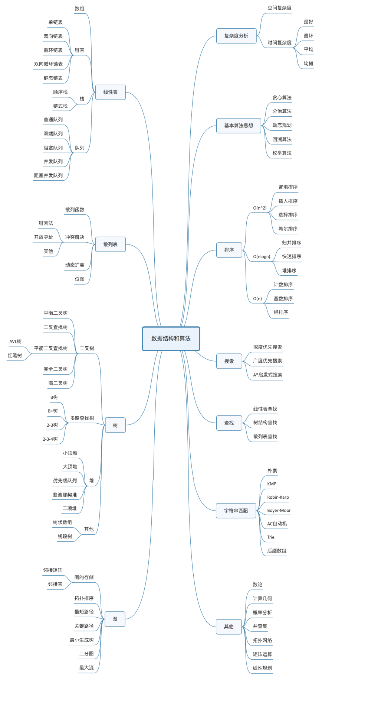

## 什么是数据结构
数据结构：指一组数据的存储结构

>逻辑结构：数据对象中的数据元素之间的相互关系
>（1）集合结构：各个数据元素是平等的
>（2）线性结构：1对1
>（3）树形结构：1对多
>（4）图形结构：多对多
>
>物理结构：数据的逻辑结构在计算机中的存储形式
>（1）顺序存储结构：把数据元素存放在地址连续的存储单元里
>（2）链式存储结构：把数据元素存放在任意的存储单元里，这些存储单元可以是连续的，也可以是不连续的

 

## 相关源码
https://gitee.com/icql/icql-java/tree/master/datastructure
https://github.com/icql/icql-java/tree/master/datastructure
https://gitee.com/icql/icql-java/tree/master/algorithm
https://github.com/icql/icql-java/tree/master/algorithm
