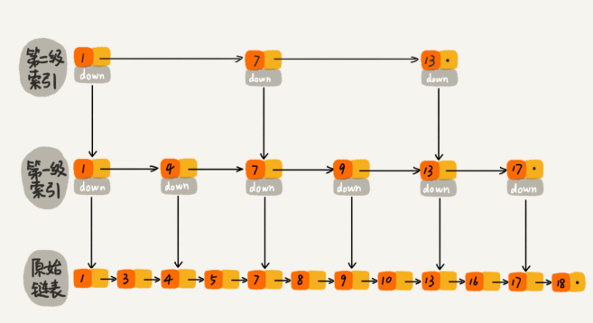

## 什么是线性表
定义：0个或多个数据元素的有限序列
存储：顺序存储（数组），链式存储（链表）

 

## 数组
用一组连续的内存空间，来存储一组具有相同类型的数据

>特点：
>（1）随机访问（用索引访问）
>（2）新增/删除需要移动大量元素（优化措施：将多次删除集中到1次删除，jvm的标记清除垃圾回收算法）
>（3）数组/容器选择：性能要求较高优先数组
>
>数组索引从0开始而非1的原因，cpu少了一次减法操作
>若1开始，a[k] = a[1]_addr + (k-1)*type_size
>若0开始，a[k] = a[0]_addr + k*type_size

 

## 链表
不需要连续的内存空间，使用零散的内存块存储数据，内存块之间有指针

### 1）常见链表
>（1）单链表：
>头结点(data,next) -> Node(data,next) -> ... -> 尾结点(data,next(null))
>（2）循环链表：
>头结点(data,next) -> Node(data,next) -> ... -> 尾结点(data,next(头结点))
>（3）双向链表：
>头结点(data,prev(null),next) -> Node(data,prev,next) -> ... -> 尾结点(data,prev,next(null))
>
>哨兵简化边界处理，带头链表，不带头链表

### 2）跳表

查询数据平均时间复杂度 O(logn)，支持范围查询，所以redis zset使用跳表实现，而不是树

 

## 栈
限定仅在一端进行插入和删除的线性表，先进后出 FILO（first in last out）

>主要功能：入栈push，出栈pop
>递归

 

## 队列
只允许在一端（队尾）进行插入操作，在另一端（队头）进行删除操作的线性表，先进先出 FIFO（first in first out）

>主要功能：入队，出队
>阻塞队列：队列为空，阻塞出队直到有数据，队列满了，阻塞入队直到队列有空闲
>并发队列：线程安全
>各种资源池