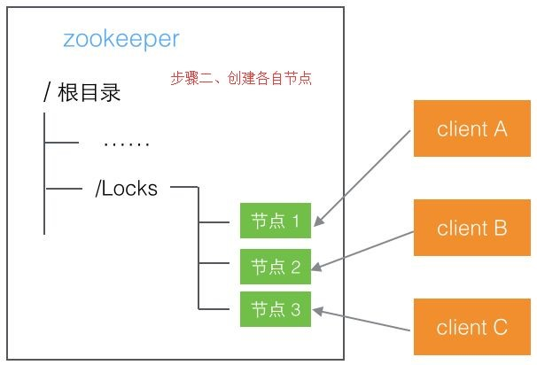

## 分布式锁
分布式环境下，控制对共享资源的同步访问

 

## 解决方案一：redis

本质上，利用redis的命令单线程有序性，对redis中的共享资源进行操作

### 1）SETNX
redis SET 命令
>SET：可以实现下面几个的命令
>SETNX：key存在，不做任何动作，返回0；key不存在，设置成功，返回1
>SETEX：相当于 SET key value，EXPIRE key seconds
>PSETEX：和SETEX相似，不过单位是毫秒

### 2）Redisson
加锁
解锁
hash

默认超时30秒，每10秒续约
https://www.cnblogs.com/AnXinliang/p/10019389.html

### 3）问题
主从集群模式下，当在主节点获取到锁时，还没来得及同步到从节点，从节点重新被选举为主节点，会造成多个线程拿到锁

redlock：
>假设有5个redis节点
>这些节点之间既没有主从
>也没有集群关系
>客户端用相同的key和随机值在5个节点上请求锁
>请求锁的超时时间应小于锁自动释放时间
>当在3个（超过半数）redis上请求到锁的时候
>才算是真正获取到了锁。如果没有获取到锁
>则把部分已锁的redis释放掉

 

## 解决方案二：zookeeper
利用zookeeper的唯一节点特性和临时有序节点特性

>1）每个客户端创建名为"/lockname/0000000001"的临时有序节点，递增
>2）获取锁时，获取"/lockname"所有已经创建的子节点
>判断1中创建的节点是所有节点中序号最小的
>那么就认为这个客户端获得了锁
>释放锁时，直接删除该临时有序节点
>3）如果创建的节点不是所有节点中需要最小的
>那么则监视（watch）比自己创建节点的序列号小的最大的节点，进入等待
>直到下次监视的子节点变更的时候，再进行子节点的获取，判断是否获取锁

 

## 解决方案三：db

### 1）悲观锁
基于数据库排他锁
select for update，利用数据库的排他锁

### 2）乐观锁
update where version = version
