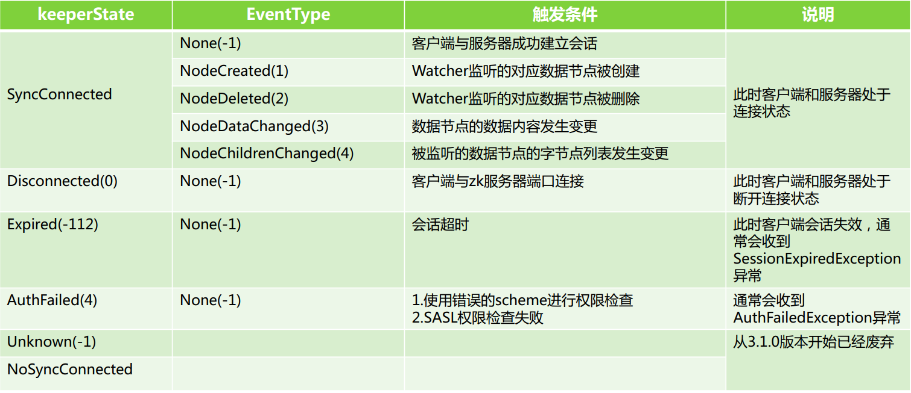

## zookeeper简介
开源的分布式应用程序协调服务中间件

特性：
>（1）顺序一致性：
>从同一个客户端发起的事务请求，最终会严格按照顺序被应用到zookeeper中
>（2）原子性：
>所有的事务请求的处理结果在整个集群中的所有机器上的应用情况是一致的，也就是说，要么整个集群中的所有机器都成功应用了某一事务、要么全都不应用
>（3）可靠性：
>一旦服务器成功应用了某一个事务数据，并且对客户端做了响应，那么这个数据在整个集群中一定是同步并且保留下来的
>（4）实时性：
>一旦一个事务被成功应用，客户端就能够立即从服务器端读取到事务变更后的最新数据状态；（zookeeper仅仅保证在一定时间内，近实时）

<br/>
<hr/>

## 安装
docker-compose

### 1）创建文件夹及docker-compose.yml文件
``` bash
├──app
	├──zookeeper
		├──zoo1
		├──zoo2
		├──zoo3
		├──docker-compose.yml
```

### 2）docker-compose.yml文件内容，相关配置需要在 docker hub上查看

``` bash
version: '3.1'

services:
  zoo1:
    image: zookeeper:3.5.5
    restart: always
    hostname: zoo1
    container_name: zookeeper_1
    #domainname: 
    ports:
      - 2181:2181
    volumes:
      - /app/zookeeper/zoo1/data:/data
      - /app/zookeeper/zoo1/datalog:/datalog
      - /app/zookeeper/zoo1/serverlog:/logs
    environment:
      ZOO_MY_ID: 1
      ZOO_SERVERS: server.1=zoo1:2888:3888;2181 server.2=zoo2:2888:3888;2181 server.3=zoo3:2888:3888;2181
      ZOO_LOG4J_PROP: "INFO,ROLLINGFILE"

  zoo2:
    image: zookeeper:3.5.5
    restart: always
    hostname: zoo2
    container_name: zookeeper_2
    ports:
      - 2182:2181
    volumes:
      - /app/zookeeper/zoo2/data:/data
      - /app/zookeeper/zoo2/datalog:/datalog
      - /app/zookeeper/zoo2/serverlog:/logs
    environment:
      ZOO_MY_ID: 2
      ZOO_SERVERS: server.1=zoo1:2888:3888;2181 server.2=zoo2:2888:3888;2181 server.3=zoo3:2888:3888;2181
      ZOO_LOG4J_PROP: "INFO,ROLLINGFILE"

  zoo3:
    image: zookeeper:3.5.5
    restart: always
    hostname: zoo3
    container_name: zookeeper_3
    ports:
      - 2183:2181
    volumes:
      - /app/zookeeper/zoo3/data:/data
      - /app/zookeeper/zoo3/datalog:/datalog
      - /app/zookeeper/zoo3/serverlog:/logs
    environment:
      ZOO_MY_ID: 3
      ZOO_SERVERS: server.1=zoo1:2888:3888;2181 server.2=zoo2:2888:3888;2181 server.3=zoo3:2888:3888;2181
      ZOO_LOG4J_PROP: "INFO,ROLLINGFILE"

```

### 3）验证zookeeper-compose.yml文件内容是否正确

docker-compose -f zookeeper-compose.yml config -q

### 4）启动集群
docker-compose -f zookeeper-compose.yml up -d

### 5）查看集群启动情况
docker-compose -f zookeeper-compose.yml ps

<br/>
<hr/>

## zookeeper基础

### 1）数据模型znode

类似于文件系统，节点znode(类似key,value)是最小数据单元，每一个znode上都可以保存数据和挂载子节点，形成树状结构

#### （1）类型

（1）持久化节点：一直保存直至主动删除
（2）持久化有序节点：有序，在节点的key后面自动加一串有序数字
（3）临时节点：会话失效该节点自动清理
（4）临时有序节点：有序


#### （2）数据结构
(key,stat)，key是名称（路径），stat存储的信息如下

> 123，数据值（value）
> cZxid = 0xa7，创建时的事务id
> ctime = Fri Jun 14 09:01:27 CST 2019，创建时间
> mZxid = 0xa7，最近修改的事务id
> mtime = Fri Jun 14 09:01:27 CST 2019，最近修改时间
> pZxid = 0xab，子节点变更的事务id
> cversion = 3，当前节点变动的版本号（包括子节点变动也会++）
> dataVersion = 0，当前节点数据变动的版本号
> aclVersion = 0，当前节点权限变动的版本号
> ephemeralOwner = 0x0，如果该节点为ephemeral(临时)节点，表示与该节点绑定的session id. 如果不是ephemeral节点, 则为0
> dataLength = 3，value数据字节数
> numChildren = 1，子节点个数


### 2）会话session

一个客户端连接是指客户端和服务器之间的一个 TCP 长连接


会话连接：
>通过会话连接
>客户端能够通过心跳检测（小于sessionTimeout的时间间隔）与服务器保持有效的会话
>也能够向 Zookeeper 服务器发送请求并接受响应
>还能够接收来自服务器的Watch事件通知

会话状态：
>CONNECTING，正在连接
>CONNECTED， 已连接
>RECONNECTING，正在重连
>RECONNECTED，已重连
>CLOSE，会话关闭，出现的原因有：会话超时，权限检查失败，客户端主动退出

sessionTimeout：
>用来设置一个客户端会话的超时时间
>当由于服务器压力太大、网络故障或是客户端主动断开连接等各种原因导致客户端连接断开时
>只要在 sessionTimeout 规定的时间内能够重新连接上集群中任意一台服务器，那么之前创建的会话仍然有效

sessionId：
>是用于唯一标识一个会话的，因此需要全局的唯一性
>sessionId的初始化是使用时间戳和server的sid进行构造，方法如下
>sessionId = ((timestamp << 24) >> 8) | (sid << 56)

超时分桶策略
>数据结构是Map<桶id,Set<会话>
>Zookeeper会为每个会话标记一个下次会话超时时间点TickTime，其值大致等于当前时间加上TimeOut
>将相近的TickTime hash到同一个桶中存放，便于批量处理超时会话

会话检查：
>每次把当前检查的桶中剩下的会话全认为是超时进行处理（不超时的会话会被移走到别的桶）
>检查一个桶后，经过固定时间后，再检查下一个桶


### 3）监控机制Watcher
``` bash
#允许客户端向服务器注册一个watcher监听
#当服务器端的节点触发指定事件的时候会触发watcher
#服务端会向客户端发送一个事件通知

#watcher的通知是一次性，一旦触发一次通知后，该watcher就失效
```


ACL：Zookeeper采用ACL（AccessControlLists）策略来进行权限控制，类似于 UNIX 文件系统的权限控制


常用命令操作：zkcli中输入help查看

java api
``` java
//官方api
<dependency>
    <groupId>org.apache.zookeeper</groupId>
    <artifactId>zookeeper</artifactId>
    <version></version>
</dependency>

//zkclient

//curator
```

<br/>
<hr/>

## zookeeper集群

### 1）集群角色
>Leader、Follower 和 Observer 3种角色
>ZooKeeper 集群中的所有机器通过一个 Leader 选举过程来选定一台称为 “Leader” 的机器
>Leader 既可以为客户端提供写服务又能提供读服务
>Follower 和  Observer 都只能提供读服务
>Follower 和 Observer 唯一的区别在于 Observer 机器不参与 Leader 的选举过程，也不参与写操作的“过半写成功”策略，因此 Observer 机器可以在不影响写性能的情况下提升集群的读性能

### 2）集群状态
（1）LOOKING 寻找leader状态 
>当前服务器处于该状态时，它会认为当前集群中没有leader，因此需要进入leader选举状态

（2）LEADING 领导者状态
>表示当前服务器角色是Leader

（3）FOLLOWING 跟随者状态
>表示当前服务器的角色是Follower

（4）OBSERVING 观察者状态
>表示当前服务器的角色是Observer

### 3）ZAB协议原理
ZAB（ZooKeeper Atomic Broadcast 原子广播）协议是为分布式协调服务 ZooKeeper 专门设计的一种支持 崩溃恢复 和 原子广播 协议

模式切换：
>当 Leader 服务可以正常使用，就进入消息广播模式，当 Leader 不可用时，则进入崩溃恢复模式

事务id zxid：
>高32位是leader的周期计数epoch，低32位是事务计数器；当有新的leader时epoch+1，事务计数器归0；总体上zxid是一直单调递增的

ZAB 协议包括两种基本的模式：
>**1）消息广播模式：**
> （1）leader收到一个写请求（从客户端或者follwer和observer转发过来的）
> （2）leader生成一个新的事务并为这个事务生成一个唯一的zxid
> （3）leader将这个事务发送给所有的follows节点
> （4）follower节点将收到的事务请求加入到历史队列(history queue)中,并发送ack给leader
> （5）当leader收到大多数follower（半数以上）的ack消息，leader会先自己commit，然后发送响应给客户端，再发送commit请求给所有follower 
> （6）当follower收到commit请求时，会判断该事务的zxid是不是比历史队列中的任何事务的ZXID都小，如果是则提交，如果不是则等待比它更小的事务的commit，顺序一致性
>
>**2）崩溃恢复模式：**
> （1）当leader崩溃后，集群进入投票选举阶段
> （2）每个Server第一次投票（选自己），投票内容是(zxid，myid)，然后将这个投票发给集群中其他节点（非Observer）
> （3）接受来自其他节点的投票，检测投票的有效性，如是否本轮投票
> （4）处理投票，比较选票：优先检查zxid，选zxid较大的，如果zxid相同，则比较myid，myid较大的节点作为新的选票(zxid，myid)
> （5）第二次投票，投出上一步选出的(zxid，myid)进行投递
> （6）每个Server收到第二次选票后统计得出 过半数 相同的选票，则以此选票的节点为leader，各自节点更新相对应的状态（Follower/Leader）
>
>3)**特殊情况zab协议必须保证：**
> 当leader在commit之后但在发出commit消息之前宕机，即只有老leader自己commit了，而其它follower都没有收到commit消息 新的leader也必须保证这个proposal被提交.(新的leader会重新发送该proprosal的commit消息)
> 当leader产生某个proprosal之后但在发出消息之前宕机，即只有老leader自己有这个proproal，当老的leader重启后(此时左右follower),新的leader必须保证老的leader必须丢弃这个proprosal.(新的leader会通知上线后的老leader截断其epoch对应的最后一个commit的位置)

## 日志
zookeeper共有3个日志：事务日志、快照日志和log4j日志

## 用途
* 数据的发布/订阅（配置中心）
* 负载均衡
* 分布式锁
* master选举
* 分布式队列