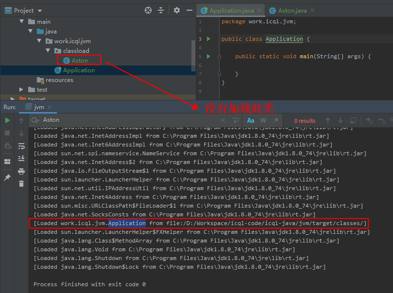
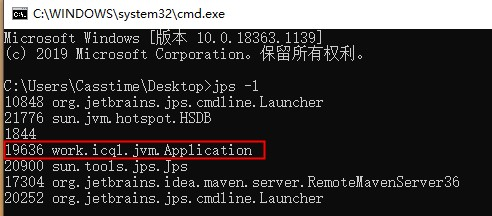
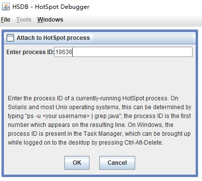
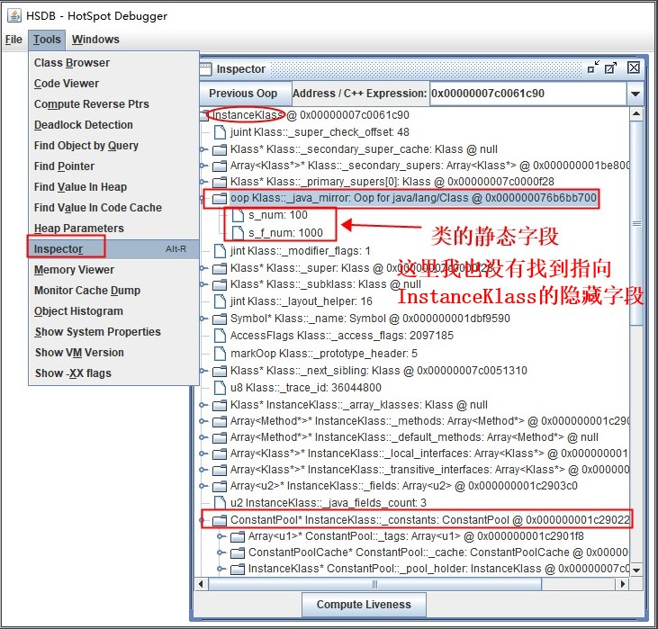
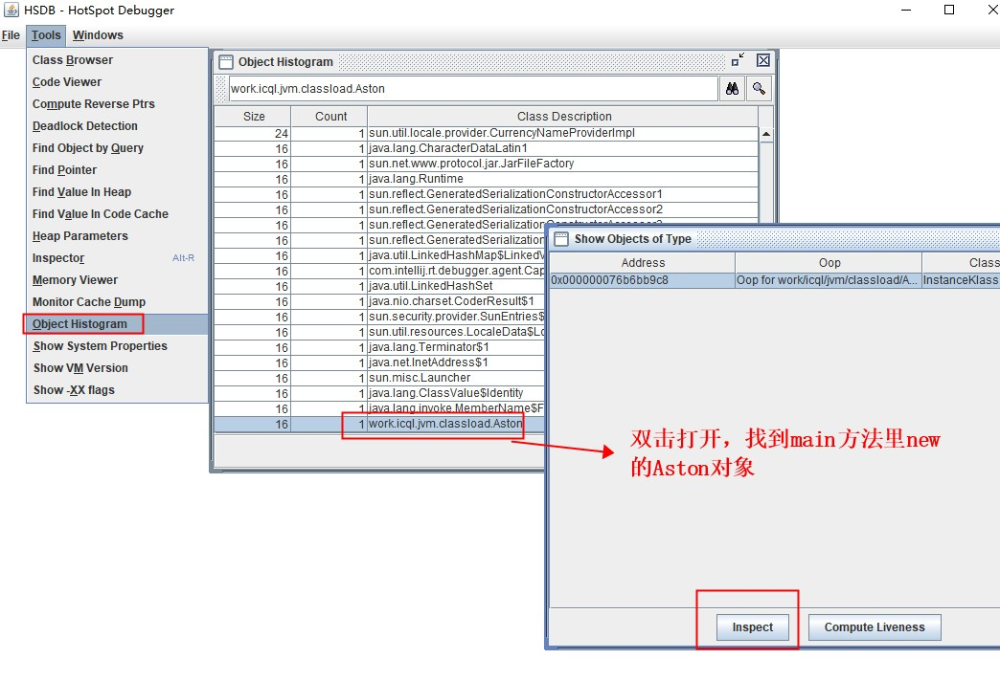
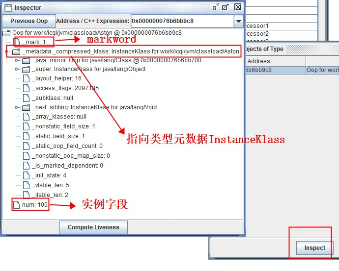
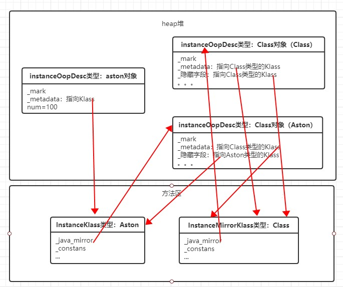
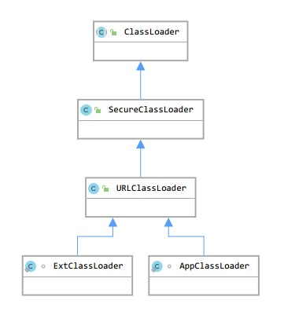
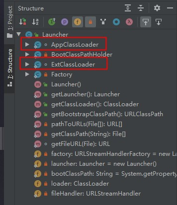

## 类加载机制
虚拟机将 **描述类的字节码数据** 在 **运行期间** 加载到内存中，对其进行一些处理转换为虚拟机可以直接使用的java类型

类的生命周期：**加载 -> 连接（验证 -> 准备 -> 解析） -> 初始化 -> 使用 -> 卸载**

**jvm进程启动时会加载jre下的部分类，其他类一般是在运行期间用到了才会去加载**

打印类加载/卸载日志参数：-verbose:class


<br/>
<hr/>

## 类加载的过程
### 1）加载 Loading

> 加载步骤
>+ 通过 **类的完全限定名** 找到 **描述类的字节码数据** 加载到内存中
>+ 将其转换为方法区的运行时数据结构

* 非数组类型
    > 可控性比较高，可以直接使用系统类加载器加载，也可以自定义类加载器进行加载
    > 类唯一性 = 类加载器 + 类的完全限定名
* 数组类型C
    > 数组类型C本身由java虚拟机直接创建
    >
    > 数组元素类型
    >+ 引用类型：元素类型由正常的类加载器加载完成后，数组类型C(含元素类型)标记为与 **元素类型的类加载器** 关联，**类唯一性 = 数组元素类型的类加载器 + 数组类型C的完全限定名**
    >+ 基本类型：虚拟机直接把 数组类型C(含元素类型) 标记为与 **启动类加载器** 关联，**类唯一性 = 启动类加载器 + 数组类型C的完全限定名**


### 2）连接 Linking

#### （1）验证 Verification
验证字节码数据是否符合当前虚拟机的要求

#### （2）准备 Preparation
为类字段(static修饰) **分配内存且初始化默认值**

> static final 且 字段类型为基本类型或字符串：直接初始化为此字段的值，通过查找字段表携带的ConstantValue属性
> static（其它）：初始化为零值

#### （3）解析 Resolution
将 **运行时常量池** 内的各种符号引用替换为直接引用，不同的符号引用解析时间也不一样，但在使用前一定是被解析了的
（这里指的是在使用当前类时需要使用这个符号引用时才会去解析）

注意：这里边的 **方法符号引用** 只会解析非虚方法，称之为 **静态解析**（具体内容查看 **字节码篇的执行引擎**）

>+ 符号引用：字面量形式的符号，和class文件常量池表示的一样
>+ 直接引用：指向内存中目标地址的指针


### 3）初始化 Initialization
执行类构造器clinit()方法，真正的开始执行java字节码（初始化之前必须要 加载-验证-准备）

clinit()方法是由编译器自动收集类中 static字段和static代码块合并产生的，按照源码从上到下顺序合并

子类clinit()方法执行前父类的clinit()一定是已经被执行了

虚拟机会保证clinit()方法线程安全

java虚拟机规范没有强制规定什么时候执行类的加载，但是规定了什么时候执行类的初始化

> **对类的主动使用会引起类的初始化：**
> 1）创建类的实例，new一个对象
> 2）类的静态字段（非常量）访问或者赋值
> 3）调用类的静态方法
> 4）反射，如 Class.forName()
> 5）初始化一个类的子类
> 6）jvm进程启动时被标明为启动的类
> 7）动态语言支持（1.7之后）
>
> **对类的被动使用（除主动使用外的）不会引起类的初始化**，例如
> 1）引用类的静态常量 static final 修饰的 基本类型或字符串（必须是字面量）
>    static final int MAX = 100;静态常量
>    static final int RANDOM = new Random().nextInt();非静态常量
> 2）构造某个类的数组 Test[] test = new Test[10];

<br/>
<hr/>

## 类加载后的运行时数据结构

大佬的文章 https://www.iteye.com/blog/rednaxelafx-1847971

### 1）hotspot 的 oop-klass 模型（jdk1.8）

hotspot没有直接将 java 实例对象映射到 C++ 对象，而是采用 oop-klass 模型进行描述

**oop 用来描述java类型实例信息（对象），klass 用来描述java类型的相关元数据**

> **为何要设计这样一个一分为二的对象模型呢？**
> 1）为了精简对象，将 **不变的类型元数据** 和 **变动的实例数据** 分开存放
> 2）将虚函数表放在类型元数据中，可以实现运行时绑定 method dispatch

``` java
虚拟机内部的两大基类：
1）oopDesc：（java对象、受GC管理的非java对象）类型的基类
2）MetaspaceObj：所有元数据对象类型的基类 

//oop的继承关系（后面是jdk8中的别名）
typedef class oopDesc*                            oop;
typedef class   instanceOopDesc*            instanceOop; //java中普通对象
typedef class   arrayOopDesc*                    arrayOop;
typedef class     objArrayOopDesc*            objArrayOop; //java中引用类型数组类的对象
typedef class     typeArrayOopDesc*            typeArrayOop; //java中基本类型数组类的对象


//Klass的继承关系，Klass :: Metadata :: MetaspaceObj
class Klass;
class   InstanceKlass;  //java中普通类型元数据
class     InstanceMirrorKlass;  //java.lang.Class的类型元数据
class     InstanceClassLoaderKlass; //java.lang.ClassLoader及其子类的类型元数据
class     InstanceRefKlass;  //java.lang.ref.Reference及其子类的类型元数据
class   ArrayKlass;
class     ObjArrayKlass;  //java中引用类型数组类的类型元数据
class     TypeArrayKlass;  //java中基本类型的数组类的类型元数据
```

**加载一个类A（普通java类型）时：**
> 1）创建类A的 **InstanceKlass 实例**，表示类A的元数据信息
> （1）**_constants字段：** 指向类A的运行时常量池（基本上和Class文件中的常量池一致，ConstantPool类型，上面Metadata的子类）
> （2）**_java_mirror字段：** 指向类A的java.lang.Class实例（java对象，instanceOop类型）
>  。。。
> 2）创建类A的 **java.lang.Class实例（java_mirror）**，主要用于运行时的反射机制
> （1）VM生成一个隐藏字段指向类A的元数据信息 **InstanceKlass 实例**
> （2）VM将 **类A的静态字段** 存储在Class实例的末端（static修饰的字段）
>  。。。

### 2）案例分析

> **HSDB工具的使用：**
> 1）jps -l 可以查看当前系统所有的jvm进程id，找到我们要查看的jvm进程id
> 2）在 jdk 路径 C:\Program Files\Java\jdk1.8.0_74\lib 下启动HSDB（如果有报错缺少什么文件，可以在jre下对应的目录中找到）
>    java -cp sa-jdi.jar sun.jvm.hotspot.HSDB
> 3）HSDB的界面：File-Attach to HotSpot process，输入第一步中的jvm进程id
> 4）具体的工具查看菜单 Tools

#### （1）准备代码

``` java
public class Aston {

    private int num = 100;

    public static int s_num = 100;

    public static final int s_f_num = 1000;

    static {
        System.out.println("类初始化");
    }
}

public class Application {
    public static void main(String[] args) throws Exception {
        Aston aston = new Aston();
        System.in.read();
    }
}
```

#### （2）使用HSDB验证分析










最后来个简单的示意图



<br/>
<hr/>

## 类卸载的时机

代码热替换、热部署等都需要java支持类的卸载，否则方法区将会内存占用将会越来越大，直至溢出

> 例如：**tomcat 中支持 jsp 热部署**
> 就是每个jsp文件编译成servlet子类
> 且每个jsp对应一个自己的类加载器
> 当改变jsp时，相当于卸载原来jsp对应的类和类加载器
> 生成一个新的类和类加载器

加载的Class只有满足以下 3 个条件，才能被GC回收，也就是该Class被卸载（unload）：
> 1）该类所有的实例没有被 GC Root 引用
> 2）该类的java.lang.Class实例没有被 GC Root 对象引用
> 3）加载该类的ClassLoader实例没有被 GC Root 对象引用

基于上述的条件：
> 1）**启动类加载器、扩展类加载器、应用类加载器 加载的类型** 在运行期间都不会被卸载
> （1）启动类加载器
> （2）扩展类加载器、应用类加载器继承的 ClassLoader 有一个字段始终引用着所加载的类
>     private final Vector<Class<?>> classes = new Vector<>();
>     而这两个加载器始终被Launcher类引用着，不会被回收，所以它们所加载的类也不会被卸载
> 2）**自定义的类加载器加载的类型** 只有满足上述的3个条件才能被回收，条件比较严苛

``` java
//自定义类加载器
public class TestClassLoader extends ClassLoader {
    @Override
    protected Class<?> findClass(String name) throws ClassNotFoundException {
        //Test类一定不能出现在 classpath 路径下，否则会先被AppClassLoader加载
        byte[] bytes = getBytesByFile("D:\\Test.class");
        if (bytes != null) {
            return this.defineClass(name, bytes, 0, bytes.length);
        }
        return super.findClass(name);
    }

    private byte[] getBytesByFile(String path) {
        File file = new File(path);
        try {
            FileInputStream fis = new FileInputStream(file);
            ByteArrayOutputStream bos = new ByteArrayOutputStream(1000);
            byte[] b = new byte[1000];
            int n;
            while ((n = fis.read(b)) != -1) {
                bos.write(b, 0, n);
            }
            fis.close();
            byte[] data = bos.toByteArray();
            bos.close();
            return data;
        } catch (Exception e) {
            e.printStackTrace();
        }
        return null;
    }
}

//vm启动参数 -verbose:class ，用于查看类的加载卸载情况
public class Application {
    public static void main(String[] args) throws Exception {
        TestClassLoader classLoader = new TestClassLoader();
        Class clazz = Class.forName("work.icql.jvm.classload.Test", true, classLoader);
        Object o = clazz.newInstance();
        System.out.println(o.getClass().getClassLoader());
        //满足上述的 3 个条件
        o = null;
        clazz = null;
        classLoader = null;
        //手动GC
        System.gc();
    }
}

//控制台最后几行的关键输出，可以看到 Loaded 和 Unloading Test类
[Loaded work.icql.jvm.classload.Test from __JVM_DefineClass__]
work.icql.jvm.classload.TestClassLoader@677327b6
[Unloading class work.icql.jvm.classload.Test 0x00000007c0061028]

```


<br/>
<hr/>

## 类加载器

**类和加载它的类加载器一同确定其在 jvm 进程中的唯一性**

虚拟机自带的 3 个类加载器的加载路径
``` java
public class Application {

    public static void main(String[] args) throws Exception {
        System.out.println("Bootstrap启动类加载器");
        System.out.println(System.getProperty("sun.boot.class.path"));
        System.out.println("=================");
        System.out.println("Extension扩展类加载器");
        System.out.println(System.getProperty("java.ext.dirs"));
        System.out.println("=================");
        System.out.println("App应用类加载器");
        System.out.println(System.getProperty("java.class.path"));
    }
}

//运行结果
Bootstrap启动类加载器
C:\Program Files\Java\jdk1.8.0_74\jre\lib\resources.jar;
C:\Program Files\Java\jdk1.8.0_74\jre\lib\rt.jar;
C:\Program Files\Java\jdk1.8.0_74\jre\lib\sunrsasign.jar;
C:\Program Files\Java\jdk1.8.0_74\jre\lib\jsse.jar;
C:\Program Files\Java\jdk1.8.0_74\jre\lib\jce.jar;
C:\Program Files\Java\jdk1.8.0_74\jre\lib\charsets.jar;
C:\Program Files\Java\jdk1.8.0_74\jre\lib\jfr.jar;
C:\Program Files\Java\jdk1.8.0_74\jre\classes
=================
Extension扩展类加载器
C:\Program Files\Java\jdk1.8.0_74\jre\lib\ext;
C:\WINDOWS\Sun\Java\lib\ext
=================
App应用类加载器
C:\Program Files\Java\jdk1.8.0_74\jre\lib\charsets.jar;
C:\Program Files\Java\jdk1.8.0_74\jre\lib\deploy.jar;
C:\Program Files\Java\jdk1.8.0_74\jre\lib\ext\access-bridge-64.jar;
C:\Program Files\Java\jdk1.8.0_74\jre\lib\ext\cldrdata.jar;
C:\Program Files\Java\jdk1.8.0_74\jre\lib\ext\dnsns.jar;
C:\Program Files\Java\jdk1.8.0_74\jre\lib\ext\jaccess.jar;
C:\Program Files\Java\jdk1.8.0_74\jre\lib\ext\jfxrt.jar;
C:\Program Files\Java\jdk1.8.0_74\jre\lib\ext\localedata.jar;
C:\Program Files\Java\jdk1.8.0_74\jre\lib\ext\nashorn.jar;
C:\Program Files\Java\jdk1.8.0_74\jre\lib\ext\sunec.jar;
C:\Program Files\Java\jdk1.8.0_74\jre\lib\ext\sunjce_provider.jar;
C:\Program Files\Java\jdk1.8.0_74\jre\lib\ext\sunmscapi.jar;
C:\Program Files\Java\jdk1.8.0_74\jre\lib\ext\sunpkcs11.jar;
C:\Program Files\Java\jdk1.8.0_74\jre\lib\ext\zipfs.jar;
C:\Program Files\Java\jdk1.8.0_74\jre\lib\javaws.jar;
C:\Program Files\Java\jdk1.8.0_74\jre\lib\jce.jar;
C:\Program Files\Java\jdk1.8.0_74\jre\lib\jfr.jar;
C:\Program Files\Java\jdk1.8.0_74\jre\lib\jfxswt.jar;
C:\Program Files\Java\jdk1.8.0_74\jre\lib\jsse.jar;
C:\Program Files\Java\jdk1.8.0_74\jre\lib\management-agent.jar;
C:\Program Files\Java\jdk1.8.0_74\jre\lib\plugin.jar;
C:\Program Files\Java\jdk1.8.0_74\jre\lib\resources.jar;
C:\Program Files\Java\jdk1.8.0_74\jre\lib\rt.jar;
D:\Workspace\icql-code\icql-java\jvm\target\classes;
C:\Users\Casstime\.m2\repository\org\openjdk\jol\jol-core\0.14\jol-core-0.14.jar;
C:\App\IDEA.2020.1\lib\idea_rt.jar
```

### 1）类加载器的种类

#### （1）Bootstrap启动类加载器
由虚拟机实现

负责加载 sun.boot.class.path(或-Xbootclasspath) 或 <JAVA_HOME>\lib 中的特定文件名的核心类库（如rt.jar）

#### （2）Extension扩展类加载器
java实现，sun.misc.Launcher.ExtClassLoader

负责加载 java.ext.dirs 或 <JAVA_HOME>\lib\ext 目录中的所有类库


#### （3）App应用类加载器
java实现，sun.misc.Launcher.AppClassLoader

负责加载 用户类路径 ClassPath 上的类库，程序中默认的类加载器

#### （4）自定义类加载器
用户还可以定制自己的类加载器

java 提供了抽象类 java.lang.ClassLoader，所有用户自定义类的类加载器都应该继承 ClassLoader 类，重写 findClass() 方法

``` java
public class TestClassLoader extends ClassLoader {
    
    public TestClassLoader(ClassLoader parent) {
        super(parent);
    }

    @Override
    public Class<?> findClass(String name) throws ClassNotFoundException {
        //logic
        return null;
    }
}
```


### 2）类加载器之间的加载关系
系统中的类（除了数组）一定是由类加载器去加载的

> **启动类加载器** 由jvm加载，实现为c++代码，其他类加载器都是java代码
> **扩展类加载器、系统类加载器、自定义类加载器** 均由 启动类加载器 加载


### 3）类加载模型

#### （1）双亲委派模型（推荐的类加载器实现方式）

**启动类加载器 <— 扩展类加载器 <— 应用类加载器 <— 自定义类加载器**

<br/>

除了顶层的启动类加载器外，其余的类加载器都应当有自己的父类加载器

类加载器之间的父子关系是 **以组合而非继承实现的**

类加载器之间的这种层次关系，称之为类加载器的双亲委派模型（Parents Delegation Model）


> **工作过程：**
> 如果一个类加载器收到了类加载的请求
> 它首先不会自己去尝试加载这个类，而是把这个请求委派给父类加载器去完成
> 每一个层次的类加载器都是如此，**因此所有的加载请求最终都会被传送到顶层的 启动类加载器 中**
> 只有当父加载器反馈自己无法完成这个加载请求（它的搜索范围中没有找到所需的类）时
> 子加载器才会尝试自己去加载


<u>**自底向上检测类是否已经加载，自顶向下尝试加载类**</u>

> **双亲委派模型的好处：**
> 保证java核心库类型安全，确保核心类库不被自定义的相同的完全限定名的类篡改
> 因为核心库必定先由启动类加载器去加载

#### （2）破坏双亲委派模型

* 1）双亲委派模型的实现代码在 ClassLoader#loadClass()中，如果用户覆盖了此方法，就会破环双亲委派，所以应当覆盖loadClass()方法中的findClass()方法

* 2）越基础的类由越上层的加载器进行加载，如果基础类又要调用回用户的代码，需要使用 **线程上下文类加载器**

java中所有涉及SPI的加载动作基本上都采用这种方式，例如JDBC、JNDI、JCE、JAXB、JBI等等

> **线程上下文类加载器（Thread Context ClassLoader）：**
> 这个类加载器可以通过java.lang.Thread类的setContextClassLoader()方法进行设置
> 如果创建线程时还未设置，它将会从父线程中继承一个，如果在应用程序的全局范围内都没有设置过的话
> 那这个类加载器默认就是应用程序类加载器

* 3）用户对于程序动态性设置，如 代码热替换（HotSwap）、模块热部署（Hot Deployment）等


<br/>
<hr/>

## 双亲委派模型简单分析（类加载器相关源码）

### 1）类加载器的结构



扩展类加载器 和 应用类加载器都是 sun.misc.Launcher 的内部类，均继承自 ClassLoader



### 2）类加载器被谁加载的

``` java
System.out.println(Launcher.class.getClassLoader());
//运行结果
null
```

由上可知，sun.misc.Launcher类是由启动类加载器（c++实现的，在java中指向null）加载的

查看Launcher源码可知（只保留了相关部分）

**扩展类加载器 和 系统类加载器 都是在 Launcher 类的实例构造方法加载的，间接的可以认为是由启动类加载器加载的**

```java
public class Launcher {
    //在Launcher类加载初始化时，new一个Launcher对象，执行Launcher的实例构造方法
    private static Launcher launcher = new Launcher();

    //实例构造方法里，加载 扩展类加载器 和 应用类加载器
    public Launcher() {
        //扩展类加载器
        Launcher.ExtClassLoader var1;
        try {
            var1 = Launcher.ExtClassLoader.getExtClassLoader();
        } catch (IOException var10) {
            throw new InternalError("Could not create extension class loader", var10);
        }
        //应用类加载器
        try {
            this.loader = Launcher.AppClassLoader.getAppClassLoader(var1);
        } catch (IOException var9) {
            throw new InternalError("Could not create application class loader", var9);
        }
    }

    //扩展类加载器（内部类）
    static class ExtClassLoader extends URLClassLoader {

        public ExtClassLoader(File[] var1) throws IOException {
            super(getExtURLs(var1), (ClassLoader)null, Launcher.factory);
            SharedSecrets.getJavaNetAccess().getURLClassPath(this).initLookupCache(this);
        }

        public static Launcher.ExtClassLoader getExtClassLoader() throws IOException {
            final File[] var0 = getExtDirs();

            try {
                return (Launcher.ExtClassLoader)AccessController.doPrivileged(new PrivilegedExceptionAction<Launcher.ExtClassLoader>() {
                    public Launcher.ExtClassLoader run() throws IOException {
                        int var1 = var0.length;

                        for(int var2 = 0; var2 < var1; ++var2) {
                            MetaIndex.registerDirectory(var0[var2]);
                        }
                        //关键部分，new一个扩展类加载器
                        return new Launcher.ExtClassLoader(var0);
                    }
                });
            } catch (PrivilegedActionException var2) {
                throw (IOException)var2.getException();
            }
        }
    }

    //应用类加载器
    static class AppClassLoader extends URLClassLoader {
        final URLClassPath ucp = SharedSecrets.getJavaNetAccess().getURLClassPath(this);

        public static ClassLoader getAppClassLoader(final ClassLoader var0) throws IOException {
            final String var1 = System.getProperty("java.class.path");
            final File[] var2 = var1 == null ? new File[0] : Launcher.getClassPath(var1);
            return (ClassLoader)AccessController.doPrivileged(new PrivilegedAction<Launcher.AppClassLoader>() {
                public Launcher.AppClassLoader run() {
                    URL[] var1x = var1 == null ? new URL[0] : Launcher.pathToURLs(var2);
                    //关键部分，new一个应用类加载器
                    return new Launcher.AppClassLoader(var1x, var0);
                }
            });
        }

        AppClassLoader(URL[] var1, ClassLoader var2) {
            super(var1, var2, Launcher.factory);
            this.ucp.initLookupCache(this);
        }
    }
}
```

### 3）什么是系统类加载器

java.lang.ClassLoader#scl 字段所指向的类加载器 叫 **System系统类加载器**

默认的 **System系统类加载器** 是 **应用类加载器**

如果vm参数中配置了 -Djava.system.class.loader，则这个类就是System系统类加载器

```java
public abstract class ClassLoader {
    //系统类加载器字段
    private static ClassLoader scl;
    
    //获取系统类加载器的方法
    @CallerSensitive
    public static ClassLoader getSystemClassLoader() {
        initSystemClassLoader();
        if (scl == null) {
            return null;
        }
        SecurityManager sm = System.getSecurityManager();
        if (sm != null) {
            checkClassLoaderPermission(scl, Reflection.getCallerClass());
        }
        return scl;
    }

    //初始化系统类加载器，这个方法只会执行一次
    //方法最前面的sclSet字段表示是否已经设置过系统类加载器
    //jvm进程启动时不知何处调用了getSystemClassLoader()方法
    //触发了设置系统类加载器这个操作
    private static synchronized void initSystemClassLoader() {
        if (!sclSet) {
            if (scl != null)
                throw new IllegalStateException("recursive invocation");
            sun.misc.Launcher l = sun.misc.Launcher.getLauncher();
            if (l != null) {
                Throwable oops = null;
                //scl默认赋值为Launcher里App应用类加载器，可以查看上面的源码
                scl = l.getClassLoader();
                try {
                    //检查是否有自定义系统类加载器，具体查看下面的内部类
                    //将应用类加载器作为入参
                    scl = AccessController.doPrivileged(
                        new SystemClassLoaderAction(scl));
                } catch (PrivilegedActionException pae) {
                    oops = pae.getCause();
                    if (oops instanceof InvocationTargetException) {
                        oops = oops.getCause();
                    }
                }
                if (oops != null) {
                    if (oops instanceof Error) {
                        throw (Error) oops;
                    } else {
                        // wrap the exception
                        throw new Error(oops);
                    }
                }
            }
            sclSet = true;
        }
    }

    //自定义系统类加载器的处理的内部类
    class SystemClassLoaderAction
        implements PrivilegedExceptionAction<ClassLoader> {
        private ClassLoader parent;
    
        SystemClassLoaderAction(ClassLoader parent) {
            this.parent = parent;
        }
        
        //最后会调用这个方法
        public ClassLoader run() throws Exception {
            //检查是否有配置java.system.class.loader属性
            //没有直接返回应用类加载器
            String cls = System.getProperty("java.system.class.loader");
            if (cls == null) {
                return parent;
            }
            //如果有，则使用应用类加载器作为"双亲"去加载这个自定义类加载器
            Constructor<?> ctor = Class.forName(cls, true, parent)
                .getDeclaredConstructor(new Class<?>[] { ClassLoader.class });
            //构造一个自定义类加载器的实例，设置为系统类加载器和线程上下文类加载器，返回
            ClassLoader sys = (ClassLoader) ctor.newInstance(
                new Object[] { parent });
            Thread.currentThread().setContextClassLoader(sys);
            return sys;
        }
    }
}
```

### 4）双亲委派的实现细节

<u>**自底向上检测类是否已经加载（jvm中的用map实现），自顶向下尝试加载类**</u>

所有的类加载器都继承自 ClassLoader ，具体的实现了细节都在 java.lang.ClassLoader#loadClass(java.lang.String, boolean) 方法

``` java
protected Class<?> loadClass(String name, boolean resolve) throws ClassNotFoundException
{
    synchronized (getClassLoadingLock(name)) {
        //首先判断类是否已经被加载过（map，key=当前类加载器+类），具体查看后面的源码
        Class<?> c = findLoadedClass(name);
        if (c == null) {
            //没有被加载过
            long t0 = System.nanoTime();
            try {
                if (parent != null) {
                    //有父加载器，向上传递，委托父加载器去尝试加载
                    c = parent.loadClass(name, false);
                } else {
                    //到这里，当前的类加载器是扩展类加载器（父类是启动类加载器，在java中用null表示）
                    //调用jvm源码向上传递到 启动类加载器 去加载
                    //加载成功返回class，不能加载返回null
                    c = findBootstrapClassOrNull(name);
                }
            } catch (ClassNotFoundException e) {
                // ClassNotFoundException thrown if class not found
                // from the non-null parent class loader
            }
            
            //父加载器未能成功加载
            if (c == null) {
                long t1 = System.nanoTime();

                //当前类加载器尝试加载，成功返回class，失败返回null

                //ClassLoader的这个方法没有实现，直接抛的异常
                //扩展类加载器和应用类加载器都继承自 java.net.URLClassLoader 
                //这里边实现了findClass()方法，具体源码查看下面
                //所以我们自定义类加载器时只需要重写这个方法即可
                c = findClass(name);

                // this is the defining class loader; record the stats
                sun.misc.PerfCounter.getParentDelegationTime().addTime(t1 - t0);
                sun.misc.PerfCounter.getFindClassTime().addElapsedTimeFrom(t1);
                sun.misc.PerfCounter.getFindClasses().increment();
            }
        }
        
        //这个参数代表类加载阶段的解析阶段
        if (resolve) {
            resolveClass(c);
        }
        return c;
    }
}

//扩展类加载器 和 应用类加载器findClass()方法的实现
public class URLClassLoader extends SecureClassLoader implements Closeable {
    protected Class<?> findClass(final String name)
        throws ClassNotFoundException
    {
        final Class<?> result;
        try {
            result = AccessController.doPrivileged(
                new PrivilegedExceptionAction<Class<?>>() {
                    public Class<?> run() throws ClassNotFoundException {
                        //这里的是将类名转成路径名，然后去类加载器各自的加载路径里去查找
                        //ucp字段在初始化扩展类加载器和应用类加载器时已经设置过了，可以查看上面的源码
                        String path = name.replace('.', '/').concat(".class");
                        Resource res = ucp.getResource(path, false);
                        if (res != null) {
                            //不为空去加载类的class文件
                            try {
                                return defineClass(name, res);
                            } catch (IOException e) {
                                throw new ClassNotFoundException(name, e);
                            }
                        } else {
                            //为空返回null，表示不能加载
                            return null;
                        }
                    }
                }, acc);
        } catch (java.security.PrivilegedActionException pae) {
            throw (ClassNotFoundException) pae.getException();
        }
        if (result == null) {
            throw new ClassNotFoundException(name);
        }
        return result;
    }
}


//方法findLoadedClass(String name);
//方法private native final Class<?> findLoadedClass0(String name);
//jvm源码中的关键部分，SystemDictionary的find方法：
Klass* SystemDictionary::find(Symbol* class_name,
                              Handle class_loader,
                              Handle protection_domain,
                              TRAPS) {
  ...
  class_loader = Handle(THREAD, java_lang_ClassLoader::non_reflection_class_loader(class_loader()));
  ClassLoaderData* loader_data = ClassLoaderData::class_loader_data_or_null(class_loader());

  ...
  unsigned int d_hash = dictionary()->compute_hash(class_name, loader_data);
  int d_index = dictionary()->hash_to_index(d_hash);

  {
    ... 
    return dictionary()->find(d_index, d_hash, class_name, loader_data,
                              protection_domain, THREAD);
  }
}

Klass* Dictionary::find(int index, unsigned int hash, Symbol* name,
                          ClassLoaderData* loader_data, Handle protection_domain, TRAPS) {
  //根据类名和类加载器计算对应的kclass在map里面对应的key
  DictionaryEntry* entry = get_entry(index, hash, name, loader_data);
  //存在，并且验证通过则返回
  if (entry != NULL && entry->is_valid_protection_domain(protection_domain)) {
    return entry->klass();
  } else {
     //否者返回null,说明不存在
    return NULL;
  }
}

```

<br/>
<hr/>

## 破环双亲委派模型简单分析（SPI机制—线程上下文类加载器TCCL）

### 1）SPI（Service Provider Interface 服务提供者接口）

> java核心库提供了各种SPI（例如JDBC相关接口）
> 约定：当服务的提供者提供了服务接口的一种实现之后
>       在jar包的 META-INF/services/ 目录里创建一个以服务接口命名的文件（具体的实现类）
>       然后jdk的SPI接口在加载类初始化时
>       会使用 java.util.ServiceLoader 这个工具类去扫描所有jar包 META-INF/services 目录
>       默认通过 **线程上下文类加载器** 去加载加载实现类


### 2）TCCL（Thread Context ClassLoader 线程上下文类加载器）

> 在双亲委托模型下
> 如果一个类由类加载器A加载，那么这个类中的依赖类也是默认由相同的类加载器加载的
> SPI的相关接口类是由 **启动类加载器** 来加载的，ServiceLoader自然也是（被SPI接口调用）
> ServiceLoader要去加载实现类（在user class path路径下），使用 **启动类加载器** 加载不了
> 只能使用 **应用类加载器** 去加载
> 这样就产生了冲突，必须要破环双亲委派，诞生了 **线程上下文类加载器**

``` java
public final class Class<T> implements java.io.Serializable,
                              GenericDeclaration,
                              Type,
                              AnnotatedElement {
    public static Class<?> forName(String className)
                throws ClassNotFoundException {
        //加载类默认是由调用者的类加载器去加载的
        Class<?> caller = Reflection.getCallerClass();
        return forName0(className, true, ClassLoader.getClassLoader(caller), caller);
    }
}
```


默认 **线程上下文类加载器** 是系统类加载器

Thread.currentThread().getContextClassLoader()

``` java

//Launcher类的构造方法
public Launcher() {
    Launcher.ExtClassLoader var1;
    try {
        var1 = Launcher.ExtClassLoader.getExtClassLoader();
    } catch (IOException var10) {
        throw new InternalError("Could not create extension class loader", var10);
    }

    try {
        this.loader = Launcher.AppClassLoader.getAppClassLoader(var1);
    } catch (IOException var9) {
        throw new InternalError("Could not create application class loader", var9);
    }
    //这里设置线程上下文类加载器 = 应用类加载器
    Thread.currentThread().setContextClassLoader(this.loader);
}

//ClassLoader类里面内部类
class SystemClassLoaderAction
    implements PrivilegedExceptionAction<ClassLoader> {
    private ClassLoader parent;

    SystemClassLoaderAction(ClassLoader parent) {
        this.parent = parent;
    }

    public ClassLoader run() throws Exception {
        String cls = System.getProperty("java.system.class.loader");
        if (cls == null) {
            return parent;
        }

        Constructor<?> ctor = Class.forName(cls, true, parent)
            .getDeclaredConstructor(new Class<?>[] { ClassLoader.class });
        ClassLoader sys = (ClassLoader) ctor.newInstance(
            new Object[] { parent });
        //如果设置了系统类加载器，设置线程上下文类加载器 = 系统类加载器
        Thread.currentThread().setContextClassLoader(sys);
        return sys;
    }
}

```

### 3）JDBC案例分析

> 链接数据库：
> Class.forName被注释掉依然可以正常运行
> 这是因为从jdk1.6开始自带的jdbc4.0版本已支持SPI服务加载机制
> 只要mysql的jar包在类路径中，就可以注册mysql驱动

``` java
//加载Class到AppClassLoader（系统类加载器），然后注册驱动类
//Class.forName("com.mysql.jdbc.Driver").newInstance(); 
String url = "jdbc:mysql://localhost:3306/test";    
//通过java库获取数据库连接
Connection conn = java.sql.DriverManager.getConnection(url, "name", "password"); 
```

具体注册数据库驱动的代码，可以看到SPI服务发现注册驱动使用了 **线程上下文类加载器** 进行加载的驱动实现类

``` java
public class DriverManager {
    //clinit方法中
    static {
        loadInitialDrivers();
        println("JDBC DriverManager initialized");
    }

    private static void loadInitialDrivers() {
        String drivers;
        try {
            drivers = AccessController.doPrivileged(new PrivilegedAction<String>() {
                public String run() {
                    return System.getProperty("jdbc.drivers");
                }
            });
        } catch (Exception ex) {
            drivers = null;
        }

        //SPI机制服务发现
        AccessController.doPrivileged(new PrivilegedAction<Void>() {
            public Void run() {
                //在这里调用 ServiceLoader.load()方法去 查找加载驱动实现类
                ServiceLoader<Driver> loadedDrivers = ServiceLoader.load(Driver.class);
                Iterator<Driver> driversIterator = loadedDrivers.iterator();

                try{
                    while(driversIterator.hasNext()) {
                        driversIterator.next();
                    }
                } catch(Throwable t) {
                // Do nothing
                }
                return null;
            }
        });

        //系统属性配置查找的驱动类
        println("DriverManager.initialize: jdbc.drivers = " + drivers);
        
        if (drivers == null || drivers.equals("")) {
            return;
        }
        String[] driversList = drivers.split(":");
        println("number of Drivers:" + driversList.length);
        for (String aDriver : driversList) {
            try {
                println("DriverManager.Initialize: loading " + aDriver);
                Class.forName(aDriver, true,
                        ClassLoader.getSystemClassLoader());
            } catch (Exception ex) {
                println("DriverManager.Initialize: load failed: " + ex);
            }
        }
    }
}

//SPI服务发现工具类
public final class ServiceLoader<S> implements Iterable<S>{

    //查找路径前缀
    private static final String PREFIX = "META-INF/services/";

    //默认使用线程上下文类加载器去加载
    public static <S> ServiceLoader<S> load(Class<S> service) {
        ClassLoader cl = Thread.currentThread().getContextClassLoader();
        return ServiceLoader.load(service, cl);
    }
    public static <S> ServiceLoader<S> load(Class<S> service, ClassLoader loader){
        return new ServiceLoader<>(service, loader);
        //一步步往里边调用
        //最后在内部类 java.util.ServiceLoader.LazyIterator#nextService 的这个方法中
        //可以看到最终调用的还是 c = Class.forName(cn, false, loader);
    }
}
```