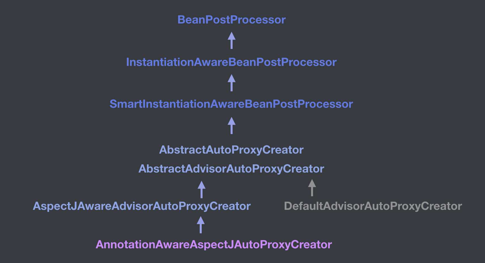

## AOP，Spring AOP，AspectJ

### 1）AOP
AOP 面向切面编程（Aspect Oriented Programming），是一种编程思想，指的是在原来的代码执行前、执行后、异常等位置包装增强一些功能

**术语：**
>**（1）Target：** 目标类，需要被代理的类。例如：UserService
>**（2）Joinpoint(连接点)：** 所谓连接点是指那些可能被拦截到的方法。例如：所有的方法
>**（3）PointCut 切入点：** 已经被增强的连接点。例如：addUser()
>**（4）Advice 通知/增强：** 增强代码
    AOP联盟通知类型
        前置通知 org.springframework.aop.MethodBeforeAdvice
        后置通知 org.springframework.aop.AfterReturningAdvice
        环绕通知 org.aopalliance.intercept.MethodInterceptor
        异常通知 org.springframework.aop.ThrowsAdvice
        引介通知：在目标类添加一些新的功能方法 org.springframework.aop.IntroductionInterceptor
>**（5）Weaving(织入)：** 是指把增强advice应用到目标对象target来创建新的代理对象proxy的过程.
>**（6）Proxy 代理类：**
>**（7）Aspect(切面)：** 是切入点pointcut和通知advice的结合
	
``` java
try{
   //前置通知
   //执行目标方法
   //后置通知
} catch(){
   //抛出异常通知
}
```

### 2）Spring AOP
spring对AOP的实现是基于动态代理（有接口用jdk动态代理实现，没有接口用CGLIB实现）

``` java
//1、原理（jdk动态代理）

//接口
public interface UserService {
    void addUser();
    void updateUser();
    void deleteUser();
}
//实现类
public class UserServiceImpl implements UserService {
    @Override
    public void addUser() {
    }
    @Override
    public void updateUser() {
    }
    @Override
    public void deleteUser() {
    }
}
//切面类
public class MyAspect {
	//通知：增强
    public void before() {
        System.out.println("方法执行前");
    }
	//通知：增强
    public void after() {
        System.out.println("方法执行后");
    }
}
//代理工厂类
public class MyBeanFactory {
    public static UserService createService() {
        //1目标类
        final UserService userService = new UserServiceImpl();
        //2切面类
        final MyAspect myAspect = new MyAspect();
        UserService proxService = (UserService) Proxy.newProxyInstance(
                MyBeanFactory.class.getClassLoader(),
                userService.getClass().getInterfaces(),
                new InvocationHandler() {
                    @Override
                    public Object invoke(Object proxy, Method method, Object[] args) throws Throwable {
                        //前执行
                        myAspect.before();
                        //执行目标类的方法
                        Object obj = method.invoke(userService, args);
                        //后执行
                        myAspect.after();
                        return obj;
                    }
                });
        return proxService;
    }
}
//测试代码
public static void main(String[] args) {
	UserService service = MyBeanFactory.createService();
	service.addUser();
	service.deleteUser();
	service.updateUser();
}

//2、原理（cglib）
//字节码增强技术，底层创建目标类的子类，包装各个方法，在前后加入通知

//3、springaop xml配置
//内部使用 ProxyFactoryBean 这个工厂bean来实现生成目标类的代理类，类似上述的 MyBeanFactory，可生成jdk动态代理或cglib代理
//3.1 创建目标类
<bean id="userServiceId" class="userService实现类全限定名"></bean>
//3.2 创建通知类，这个切面类需要实现什么类型的通知就要 实现aop联盟规定的接口
<bean id="myAspectId" class="切面类全限定名"></bean>
//3.3 springaop编程，proxy-target-class="true"则使用cglib，默认有接口则使用jdk代理，没有接口则使用cglib
<aop:config proxy-target-class="true">
	//切点集合
	//execution(包名.*.*(..))
	//返回值任意 包名.类名任意.方法名任意(参数任意)
	<aop:pointcut id="myPointCut" expression="execution(包名.*.*(..))"/>
	//切面
	<aop:advisor advice-ref="myAspectId" pointcut-ref="myPointCut"/>
</aop:config>
```

### 3）AspectJ
AOP编程的完全解决方案，支持在编译期、编译后、类加载前进行改写代码进行增强，Spring2.0以后新增了对AspectJ切点表达式支持

``` java
//使用实例

@Aspect
@Component
@Slf4j
public class LogTraceAspect {

    @Around("@annotation(logTrace)")
    public Object around(ProceedingJoinPoint point, LogTrace logTrace) throws Throwable {
        String title = StringUtils.isEmpty(logTrace.title()) ? point.toShortString().substring(9) : logTrace.title();
        boolean traceId = logTrace.traceId();
        boolean timeCost = logTrace.timeCost();
        boolean printReq = logTrace.printParam();
        boolean printResp = logTrace.printReturn();
        boolean printCaller = logTrace.printCaller();

        Object result = null;
        try {
            if (traceId) {
                MDC.put("traceId", " traceId:" + IdWorker.getIdStr());
            }
            long start = System.currentTimeMillis();
            if (printReq) {
                log.info("{},入参:{}", title, JsonUtil.serializer(point.getArgs()));
            }

            //执行原方法
            result = point.proceed();
            if (timeCost && printResp) {
                log.info("{},耗时:{},出参:{}", title, System.currentTimeMillis() - start, JsonUtil.serializer(result));
            } else if (timeCost) {
                log.info("{},耗时:{}", title, System.currentTimeMillis() - start);
            } else if (printResp) {
                log.info("{},出参:{}", title, JsonUtil.serializer(result));
            }
            if (printCaller) {
                StackTraceElement[] stackTrace = Thread.currentThread().getStackTrace();
                List<StackTraceElement> casstimeStackTraces = Arrays.stream(stackTrace).filter(p -> p.getClassName().contains("casstime")).collect(Collectors.toList());
                log.info("{},调用方:{}", title, casstimeStackTraces);
            }
        } catch (Exception e) {
            throw e;
        } finally {
            if (traceId) {
                MDC.clear();
            }
        }
        return result;
    }
}

@Retention(RetentionPolicy.RUNTIME)
@Target({ElementType.METHOD})
public @interface LogTrace {

    String title() default "";

    /**
     * 打印当前线程日志唯一ID，默认为true
     * 注意：当嵌套使用该注解时，里层的所有方法该注解都要设置此值为false
     *
     * @return
     */
    boolean traceId() default true;

    boolean timeCost() default false;

    boolean printParam() default false;

    boolean printReturn() default false;

    boolean printCaller() default false;
}
```

<br/>
<hr/>

## Spring AOP源码

**@AspectJ 的实现原理：**
>开启 @AspectJ 的两种方式
>（1）<aop:aspectj-autoproxy/>，
>（2）@EnableAspectJAutoProxy
>原理是一样的，都是通过注册一个 bean 来实现的

``` java
//分析第一种
//解析 <aop:aspectj-autoproxy/> 需要用到 AopNamespaceHandler

public class AopNamespaceHandler extends NamespaceHandlerSupport {
    public AopNamespaceHandler() {
    }

    public void init() {
        this.registerBeanDefinitionParser("config", new ConfigBeanDefinitionParser());
        //重点关注 注册的这个bean
        this.registerBeanDefinitionParser("aspectj-autoproxy", new AspectJAutoProxyBeanDefinitionParser());
        this.registerBeanDefinitionDecorator("scoped-proxy", new ScopedProxyBeanDefinitionDecorator());
        this.registerBeanDefinitionParser("spring-configured", new SpringConfiguredBeanDefinitionParser());
    }
}

//最后注册的 bean 是 AnnotationAwareAspectJAutoProxyCreator
//org.springframework.aop.config.AopConfigUtils#registerAspectJAnnotationAutoProxyCreatorIfNecessary(org.springframework.beans.factory.support.BeanDefinitionRegistry, java.lang.Object)
@Nullable
public static BeanDefinition registerAspectJAnnotationAutoProxyCreatorIfNecessary(BeanDefinitionRegistry registry, @Nullable Object source) {
    return registerOrEscalateApcAsRequired(AnnotationAwareAspectJAutoProxyCreator.class, registry, source);
}

```

### 1）AnnotationAwareAspectJAutoProxyCreator

可以看到 AnnotationAwareAspectJAutoProxyCreator 也是一个 BeanPostProcessor



### 2）AbstractAutoProxyCreator
spring_ioc分析的源码中，可以看到 initializeBean 方法（bean实例化属性装配后的各种回调）中调用了 applyBeanPostProcessorsAfterInitialization 方法

``` java
	@Override
	public Object applyBeanPostProcessorsAfterInitialization(Object existingBean, String beanName)
			throws BeansException {

		Object result = existingBean;
		for (BeanPostProcessor processor : getBeanPostProcessors()) {
		    //最后执行的是 processor 的 postProcessAfterInitialization 方法
			Object current = processor.postProcessAfterInitialization(result, beanName);
			if (current == null) {
				return result;
			}
			result = current;
		}
		return result;
	}
```

AnnotationAwareAspectJAutoProxyCreator 继承的 AbstractAutoProxyCreator 实现了该方法
``` java
@Override
public Object postProcessAfterInitialization(@Nullable Object bean, String beanName) {
    if (bean != null) {
        Object cacheKey = getCacheKey(bean.getClass(), beanName);
        if (this.earlyProxyReferences.remove(cacheKey) != bean) {
            //包装bean
            return wrapIfNecessary(bean, beanName, cacheKey);
        }
    }
    return bean;
}

//包装bean
protected Object wrapIfNecessary(Object bean, String beanName, Object cacheKey) {
   if (beanName != null && this.targetSourcedBeans.contains(beanName)) {
      return bean;
   }
   if (Boolean.FALSE.equals(this.advisedBeans.get(cacheKey))) {
      return bean;
   }
   if (isInfrastructureClass(bean.getClass()) || shouldSkip(bean.getClass(), beanName)) {
      this.advisedBeans.put(cacheKey, Boolean.FALSE);
      return bean;
   }

   //返回匹配当前 bean 的所有的 advisor、advice、interceptor
   //对于本文的例子，"userServiceImpl" 和 "OrderServiceImpl" 这两个 bean 创建过程中，
   //到这边的时候都会返回两个 advisor
   Object[] specificInterceptors = getAdvicesAndAdvisorsForBean(bean.getClass(), beanName, null);
   if (specificInterceptors != DO_NOT_PROXY) {
      this.advisedBeans.put(cacheKey, Boolean.TRUE);
      //创建代理
      Object proxy = createProxy(
            bean.getClass(), beanName, specificInterceptors, new SingletonTargetSource(bean));
      this.proxyTypes.put(cacheKey, proxy.getClass());
      return proxy;
   }

   this.advisedBeans.put(cacheKey, Boolean.FALSE);
   return bean;
}

//用proxyFactory实例创建代理
protected Object createProxy(
      Class<?> beanClass, String beanName, Object[] specificInterceptors, TargetSource targetSource) {

   if (this.beanFactory instanceof ConfigurableListableBeanFactory) {
      AutoProxyUtils.exposeTargetClass((ConfigurableListableBeanFactory) this.beanFactory, beanName, beanClass);
   }

   //创建 ProxyFactory 实例
   ProxyFactory proxyFactory = new ProxyFactory();
   proxyFactory.copyFrom(this);

   //proxy-target-class="true",这样不管有没有接口，都使用 CGLIB 来生成代理
   //  <aop:config proxy-target-class="true">......</aop:config>
   if (!proxyFactory.isProxyTargetClass()) {
      if (shouldProxyTargetClass(beanClass, beanName)) {
         proxyFactory.setProxyTargetClass(true);
      }
      else {
         //默认处理
         //（1）有接口的，调用一次或多次：proxyFactory.addInterface(ifc);
         //（2）没有接口的，调用：proxyFactory.setProxyTargetClass(true);
         evaluateProxyInterfaces(beanClass, proxyFactory);
      }
   }

   //匹配当前 bean 的 advisors 数组
   Advisor[] advisors = buildAdvisors(beanName, specificInterceptors);
   for (Advisor advisor : advisors) {
      proxyFactory.addAdvisor(advisor);
   }

   proxyFactory.setTargetSource(targetSource);
   customizeProxyFactory(proxyFactory);

   proxyFactory.setFrozen(this.freezeProxy);
   if (advisorsPreFiltered()) {
      proxyFactory.setPreFiltered(true);
   }
   
   //创建代理
   return proxyFactory.getProxy(getProxyClassLoader());
}
```

### 3）ProxyFactory

核心流程：
ProxyFactory#getProxy -> AopProxy#getProxy

``` java
//AopProxy有两个实现类
//（1）CglibAopProxy#getProxy(java.lang.ClassLoader)
//（2）JdkDynamicAopProxy#getProxy(java.lang.ClassLoader)

//ProxyFactory上面调用链中createAopProxy 有判断使用哪种方式

//JdkDynamicAopProxy的实现方式
@Override
public Object getProxy(@Nullable ClassLoader classLoader) {
    if (logger.isTraceEnabled()) {
        logger.trace("Creating JDK dynamic proxy: " + this.advised.getTargetSource());
    }
    Class<?>[] proxiedInterfaces = AopProxyUtils.completeProxiedInterfaces(this.advised, true);
    findDefinedEqualsAndHashCodeMethods(proxiedInterfaces);
    return Proxy.newProxyInstance(classLoader, proxiedInterfaces, this);
}

//Cglib 创建目标类的子类实现

```

<br/>
<hr/>

## AOP的应用

### 1）事务管理

@Transactional(rollbackFor = Exception.class)

**spring事务传播行为（7种）：**
>当事务方法被另一个事务方法调用时，必须指定事务应该如何传播
>（1）REQUIRED：默认值，当前方法必须运行在事务中。如果传播过来时事务已经存在，方法将会在该事务中运行。否则，会启动一个新的事务
>（2）SUPPORTS：当前方法不需要事务上下文，但是如果存在当前事务的话，那么该方法会在这个事务中运行
>（3）MANDATORY：表示该方法必须在事务中运行，如果当前事务不存在，则会抛出一个异常
>（4）REQUIRED_NEW：表示当前方法必须运行在它自己的事务中。一个新的事务将被启动。如果存在当前事务，在该方法执行期间，当前事务会被挂起。如果使用JTATransactionManager的话，则需要访问TransactionManager
>（5）NOT_SUPPORTED：表示该方法不应该运行在事务中。如果存在当前事务，在该方法运行期间，当前事务将被挂起。如果使用JTATransactionManager的话，则需要访问TransactionManager
>（6）NEVER：表示当前方法不应该运行在事务上下文中。如果当前正有一个事务在运行，则会抛出异常
>（7）NESTED：表示如果当前已经存在一个事务，那么该方法将会在嵌套事务中运行。嵌套的事务可以独立于当前事务进行单独地提交或回滚。如果当前事务不存在，那么其行为与PROPAGATION_REQUIRED一样。注意各厂商对这种传播行为的支持是有所差异的。可以参考资源管理器的文档来确认它们是否支持嵌套事务
